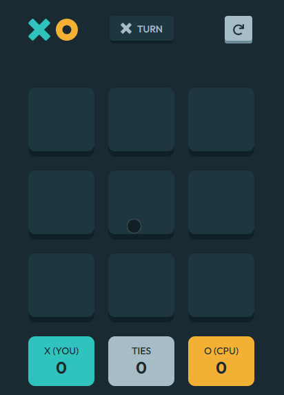

# Tic-Tac-Toe

## [Demo](https://kylelamse.github.io/tic-tac-toe/)



# Features

## CPU Mode

-   Impossible to beat. (At best you can tie)
-   Uses the [minimax algorithm](https://en.wikipedia.org/wiki/Minimax) to compute a decision tree of all possible moves.
-   Drives you a little insane.

## Two Player Mode

-   Play with friends
-   Keep score of wins, ties, and losses.

# Installation

## Prerequisites

-   [Node.js](https://nodejs.org/en/)
-   [yarn 2.x or greater](https://yarnpkg.com/getting-started/install)

## Building

In the project, run:

```sh
yarn
```

This will install the necessary dependencies.

After that, run:

```sh
yarn run build
```

Then you can open `build/index.html` and use the app.

## Development

If you want to run a live server just run:

```sh
yarn start
```

This will open a tab in your default browser.

Try making changes to anything in the `src` folder. It will automatically load the changes in the browser.

# Built With

-   [React](https://reactjs.org/)
-   [Emotion](https://emotion.sh/docs/introduction)
-   [Recoil](https://recoiljs.org/)
